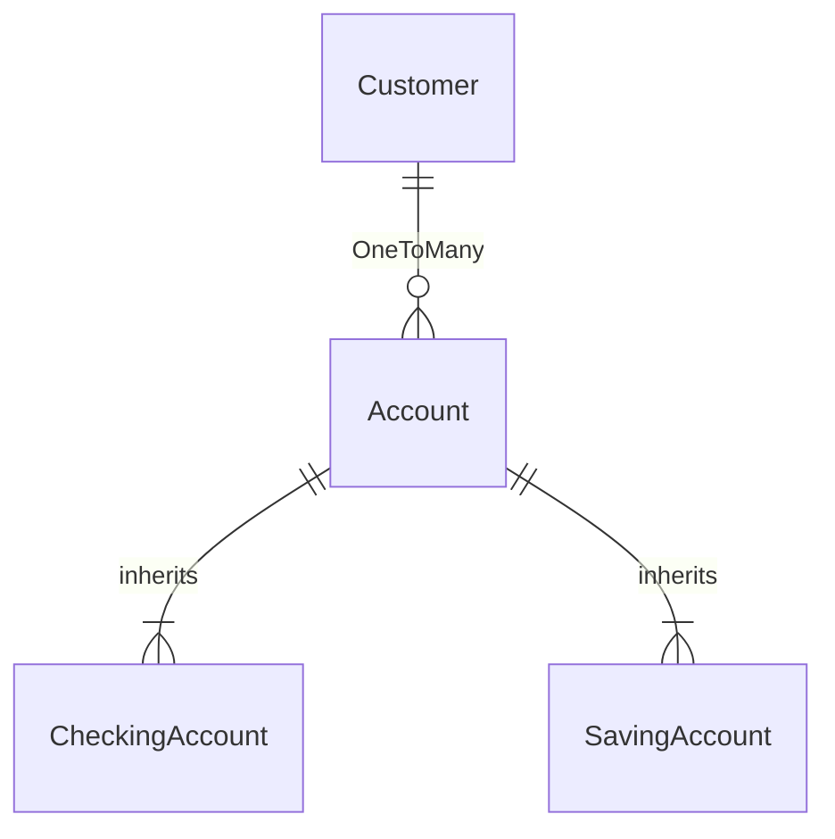

# BankingAppMicroService-SpringBoot

a simple project to reproduce a banking system;
```java
This is a side project for the weekend using the knowledge I have learnt as a practice.

```

### 1. Spring Initialzr
```python
Dependencies are: 
Spring Web, Spring Data JPA, Lombok, Validation, MySQL Driver and Spring Boot DevTool.
```

```python
prior to April 22, 2022, the training has covered: 
```

- [x] Core Concept of Java, 
- [x] Spring Boot Framework
- [x] MicroServices
- [x] RESTful API
- [x] MySql Workbench
- [x] Junit Testing
- [ ] 
.... 
#### ## Materials to cover are:  ####
- [ ] Spring Security
- [ ] Exceptional Handling
- [ ] AWS


<br>

### 2. Project Entity Relationship 




<br>

### 3. Business Logic

**Custoemr**


<br>

### 4. Project Logs

```python

desgined ORM
created models for Customer , Account , CheckingAccount , SavingAccount
connected to MySql and successfully created tables accordingly.
```

```python


1. new customer can be created; 
2. once a customer is created, a new account can be created by given customer ID;
3. more than one checking account can be created for one customer; 
4. each new checking account will come as current_balance: zero; previous_balance: zero, date upon create, action('activate', 'withdraw', 'deposit'). customer_id)
5. have Swagger dependency injected for documentation purposes for later. 
```

