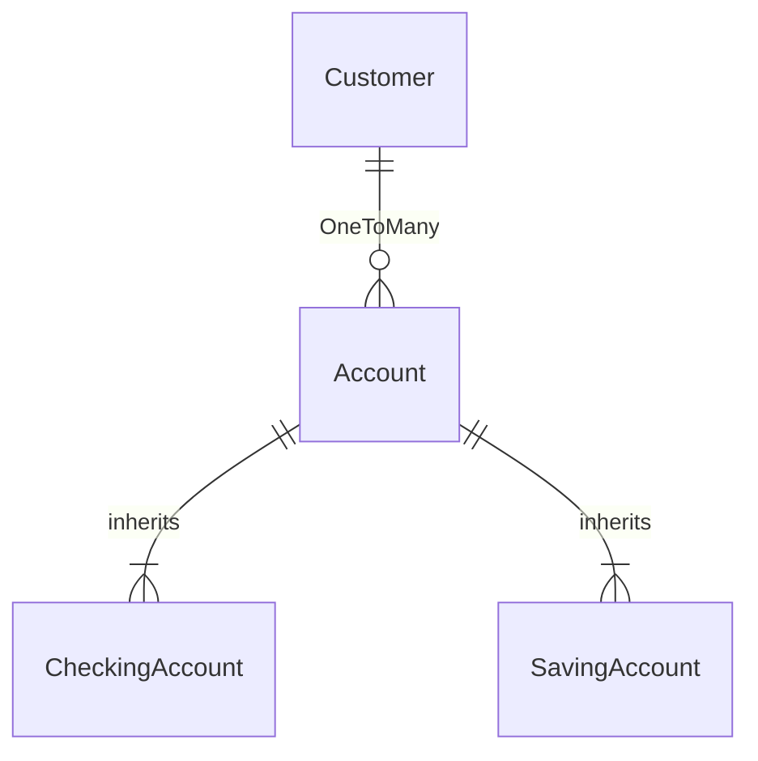

# BankingAppMicroService-SpringBoot

### 1. Spring Initialzr
```python
Dependencies are: 
Spring Web, Spring Data JPA, Lombok, Validation, MySQL Driver and Spring Boot DevTool.
```


```java
This is a side project I do during the weekend using the knowledges I have learnt from the java full stack training as a practice.
prior to April 22, 2022, the training has covered: 
```
- [x] Core Concept of Java, 
- [x] Spring Boot Framework
- [x] MicroServices
- [x] RESTful API
- [x] MySql Workbench
- [x] Junit Testing
- [ ] 
.... 
#### ## Materials to cover are:  ####
- [ ] Spring Security
- [ ] Exceptional Handling
- [ ] AWS


### 2. Entity Relationship 


