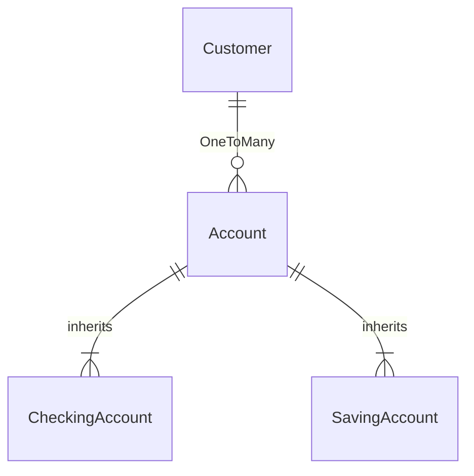

# BankingAppMicroService-SpringBoot

a simple project to reproduce a banking system;
```java
This is a side project for the weekend using the knowledge I have learnt as a practice.

```

### 1. Spring Initialzr
```python
Dependencies are: 
Spring Web, Spring Data JPA, Lombok, Validation, MySQL Driver and Spring Boot DevTool.
```

```python
prior to April 22, 2022, the training has covered: 
```

- [x] Core Concept of Java, 
- [x] Spring Boot Framework
- [x] MicroServices
- [x] RESTful API
- [x] MySql Workbench
- [x] Junit Testing
- [ ] 
.... 
#### ## Materials to cover are:  ####
- [ ] Spring Security
- [ ] Exceptional Handling
- [ ] AWS


<br>

### 2. Project Entity Relationship 




<br>

### 3. Business Logic

**Custoemr**

1. once a new customer is created, a new checking account will be activated too; (balance: 0, action: activate); --> however, I can't add the current Date when activate a new account 🥲 yet. 


<br>

### 4. Project Logs

```python
April 22 2022: started project. 
desgined ORM
created models for Customer , Account , CheckingAccount , SavingAccount
connected to MySql and successfully created tables accordingly.
```


